## Ember Engine

* [World / Level / Scene](#world-/-level-/-scene)
* [Material](#material)
* [Scheduling](#scheduling)
    + [Stage Pipeline](#scheduling-pipeline)

> Geometry
* Each geometry object can be converted to a mesh by a snapshot based on the given parameter
* A static converted mesh from a geometry doesn't apply implicitly any transformation based on entity state or targeted mesh state
* A geometry may be continuous
* A continuous object can create a parametric snapshot of it's state
* Each snapshot created via parametric invocation is explicit and independent to previous or future invocations
* A continuous object can be approximated by or converted to a subdivision surface primitive type

> Mesh
* Each mesh may hold a vertex and index buffers
* If mesh doesn't hold buffer, buffers can be dynamically calculated and cache for externally defined lifetime
* The state of a polygone mesh is completly described by it's indices, vertices and bones
* A mesh may hold subdivision surfaces
* If mesh holds subdivision surfaces, the current state of a instance of this mesh and be precalculated and cache over external define lifetime

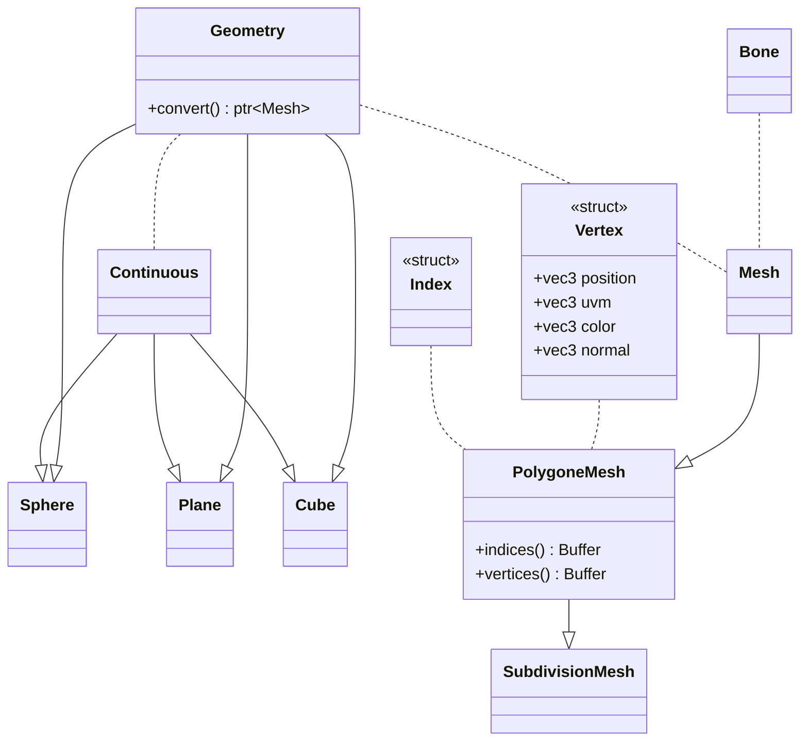
```mermaid
classDiagram
    class Geometry {
        +convert() ptr~Mesh~
    }

    Geometry .. Continuous
    class Continuous {
    }

    Geometry --|> Sphere
    Continuous --|> Sphere
    class Sphere

    Geometry --|> Plane
    Continuous --|> Plane
    class Plane

    Geometry --|> Cube
    Continuous --|> Cube
    class Cube

    class Bone {
    }

    class Vertex {
        <<struct>>
        +vec3 position
        +vec3 uvm
        +vec3 color
        +vec3 normal
    }

    class Index {
        <<struct>>
    }

    Bone .. Mesh
    Geometry .. Mesh
    class Mesh {
    }

    Mesh --|> PolygoneMesh
    Vertex .. PolygoneMesh
    Index .. PolygoneMesh
    class PolygoneMesh {
        +indices() Buffer
        +vertices() Buffer
    }

    PolygoneMesh --|> SubdivisionMesh
    class SubdivisionMesh {
    }
```

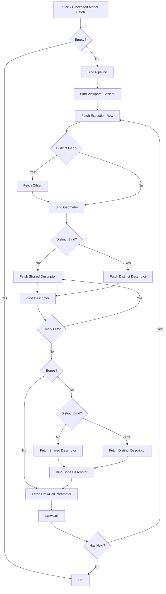
```mermaid
flowchart TD
    Z[Exit]

    A[Start / Processed Model Batch] --> B{Empty?};
    B ----> |Yes| Z
    B --> |No| C[Bind Pipeline]
    C --> D[Bind Viewport / Scissor]
    D --> E[Fetch Execution Row]
    E --> F{Distinct Geo.?}
    F --> |Yes| G[Fetch Offset]
    G --> H[Bind Geometry]
    F --> |No| H
    H --> I{Distinct Bind?}
    I --> |No| J[Fetch Shared Descriptor]
    J --> K[Bind Descriptor]
    I --> |Yes| L[Fetch Distinct Descriptor]
    L --> K
    K --> T{Empty Left?}
    T --> |No| M{Bones?}
    T --> |Yes| J
    M --> |No| N[Fetch DrawCall Parameter]
    N --> O[DrawCall]
    M --> |Yes| P{Distinct Bind?}
    P --> |No| Q[Fetch Shared Descriptor]
    Q --> R[Bind Bone Descriptor]
    P --> |Yes| S[Fetch Distinct Descriptor]
    S --> R
    R --> N
    O --> U{Has Next?}
    U --> |No| Z
    U --> |Yes| E
```

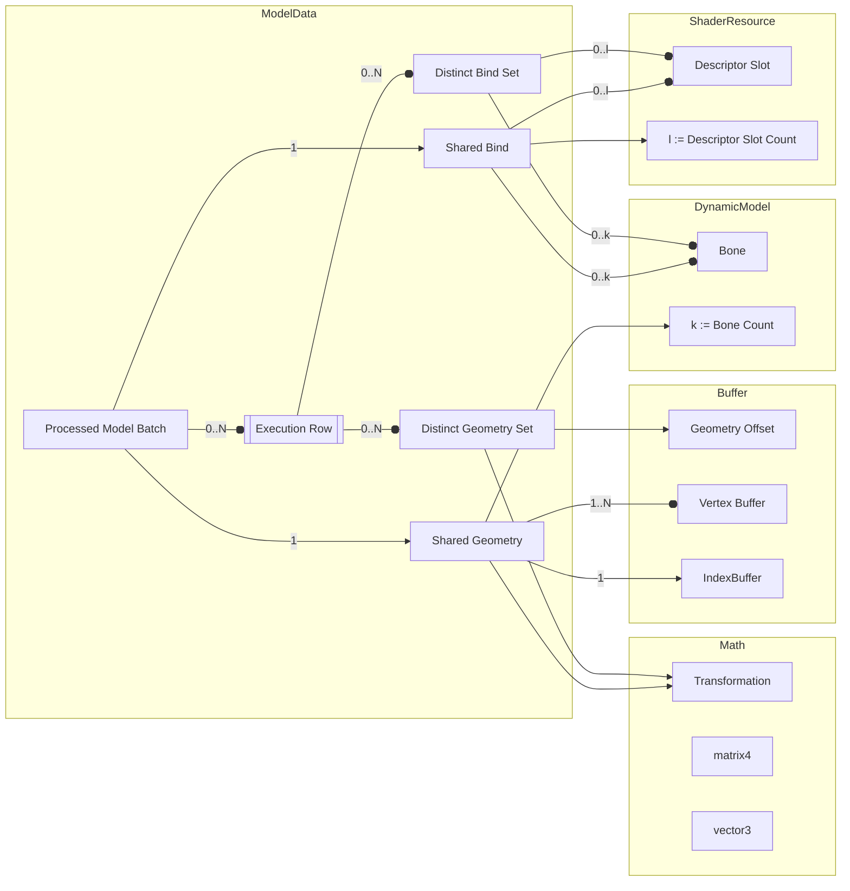
```mermaid
flowchart LR
    subgraph ModelData
        ProcessedModelBatch[Processed Model Batch]
        ExecutionRow[[Execution Row]]

        SharedBind[Shared Bind]
        SharedGeometry[Shared Geometry]
        DistinctGeometrySet[Distinct Geometry Set]
        DistinctBindSet[Distinct Bind Set]
    end

    subgraph Math
        Transformation[Transformation]
        mat4f[matrix4<float>]
        vec3f[vector3<float>]
    end

    subgraph Buffer
        GeometryOffset[Geometry Offset]
        VertexBuffer[Vertex Buffer]
        IndexBuffer[IndexBuffer]
    end

    subgraph ShaderResource
        DescriptorSlot[Descriptor Slot]
        SlotCount[l := Descriptor Slot Count]
    end

    subgraph DynamicModel
        Bone[Bone]
        BoneCount[k := Bone Count]
    end

    ProcessedModelBatch --o |0..N| ExecutionRow
    ProcessedModelBatch --> |1| SharedBind
    ProcessedModelBatch --> |1| SharedGeometry

    ExecutionRow --o |0..N| DistinctBindSet
    ExecutionRow --o |0..N| DistinctGeometrySet

    SharedBind --o |0..l| DescriptorSlot
    SharedBind --> SlotCount
    SharedBind --o |0..k| Bone

    SharedGeometry --o |1..N| VertexBuffer
    SharedGeometry --> |1| IndexBuffer
    SharedGeometry --> Transformation
    SharedGeometry --> BoneCount

    DistinctBindSet --o |0..l| DescriptorSlot
    DistinctBindSet --o |0..k| Bone

    DistinctGeometrySet --> GeometryOffset
    DistinctGeometrySet --> Transformation
```

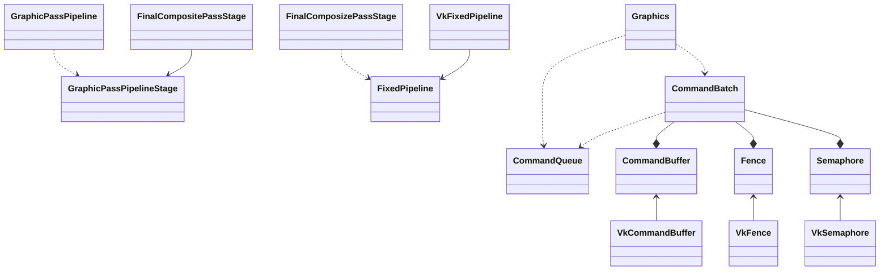
```mermaid
classDiagram
    GraphicPassPipeline ..> GraphicPassPipelineStage
    FinalCompositePassStage --> GraphicPassPipelineStage
    FinalComposizePassStage ..> FixedPipeline
    VkFixedPipeline --> FixedPipeline

    Graphics ..> CommandQueue
    Graphics ..> CommandBatch
    CommandBatch ..> CommandQueue
    CommandBatch --* CommandBuffer
    CommandBatch --* Fence
    CommandBatch --* Semaphore

    CommandBuffer <-- VkCommandBuffer
    Fence <-- VkFence
    Semaphore <-- VkSemaphore
```

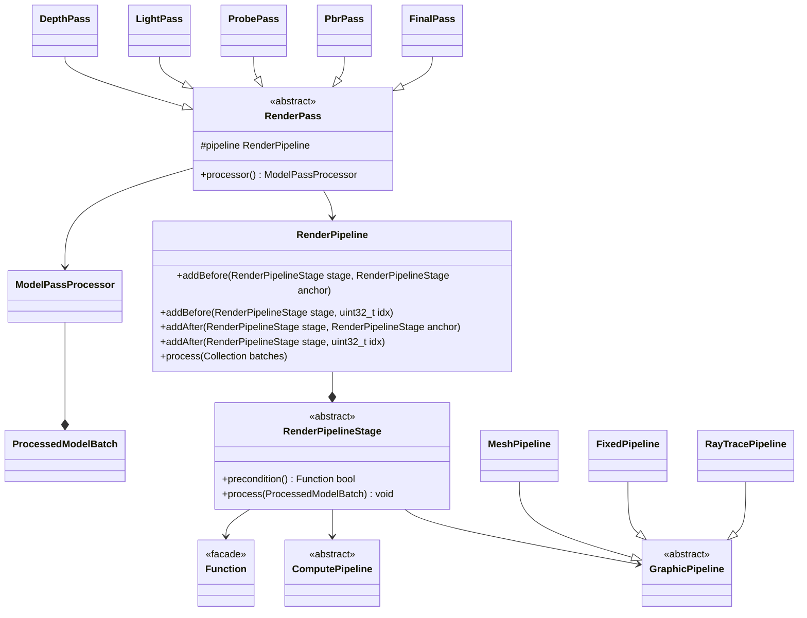
```mermaid
classDiagram
    RenderPass --> RenderPipeline
    RenderPass --> ModelPassProcessor
    class RenderPass {
        <<abstract>>
        #pipeline RenderPipeline
        +processor() ModelPassProcessor
    }

    ModelPassProcessor --* ProcessedModelBatch
    class ModelPassProcessor

    class ProcessedModelBatch

    DepthPass --|> RenderPass
    class DepthPass

    LightPass --|> RenderPass
    class LightPass

    ProbePass --|> RenderPass
    class ProbePass

    PbrPass --|> RenderPass
    class PbrPass

    FinalPass --|> RenderPass
    class FinalPass

    RenderPipeline --* RenderPipelineStage
    class RenderPipeline {
        +addBefore(RenderPipelineStage stage, RenderPipelineStage anchor)
        +addBefore(RenderPipelineStage stage, uint32_t idx)

        +addAfter(RenderPipelineStage stage, RenderPipelineStage anchor)
        +addAfter(RenderPipelineStage stage, uint32_t idx)

        +process(Collection<ProcessedModelBatch> batches)
    }

    RenderPipelineStage --> ComputePipeline
    RenderPipelineStage --> GraphicPipeline
    RenderPipelineStage --> Function
    class RenderPipelineStage {
        <<abstract>>
        +precondition() Function bool
        +process(ProcessedModelBatch) void
    }

    class Function {
        <<facade>>
    }

    class ComputePipeline {
        <<abstract>>
    }

    class GraphicPipeline {
        <<abstract>>
    }

    MeshPipeline --|> GraphicPipeline
    class MeshPipeline

    FixedPipeline --|> GraphicPipeline
    class FixedPipeline

    RayTracePipeline --|> GraphicPipeline
    class RayTracePipeline
```

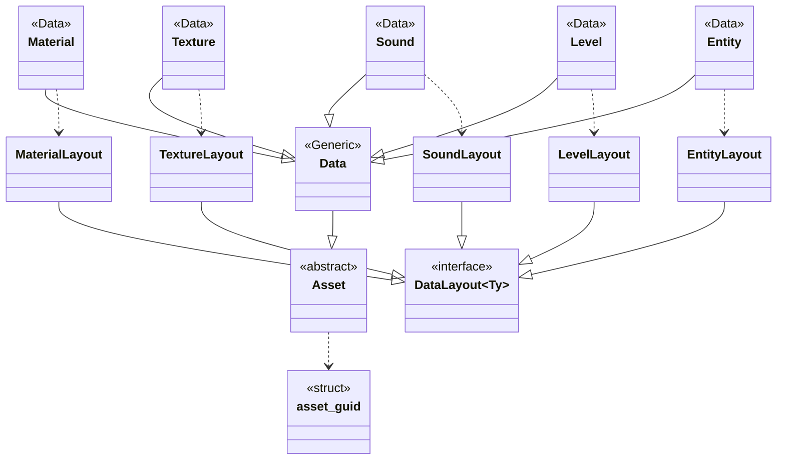
```mermaid
classDiagram
    class DataLayout~Ty~ {
        <<interface>>
    }

    class asset_guid {
        <<struct>>
    }

    Asset ..> asset_guid
    class Asset {
        <<abstract>>
    }

    Data --|> Asset
    class Data {
        <<Generic<Layout>>>
    }

    MaterialLayout --|> DataLayout
    class MaterialLayout

    Material --|> Data
    Material ..> MaterialLayout
    class Material {
        <<Data<MaterialLayout>>>
    }

    TextureLayout --|> DataLayout
    class TextureLayout

    Texture --|> Data
    Texture ..> TextureLayout
    class Texture {
        <<Data<TextureLayout>>>
    }

    SoundLayout --|> DataLayout
    class SoundLayout

    Sound --|> Data
    Sound ..> SoundLayout
    class Sound {
        <<Data<SoundLayout>>>
    }

    LevelLayout --|> DataLayout
    class LevelLayout

    Level --|> Data
    Level ..> LevelLayout
    class Level {
        <<Data<LevelLayout>>>
    }

    EntityLayout --|> DataLayout
    class EntityLayout

    Entity --|> Data
    Entity ..> EntityLayout
    class Entity {
        <<Data<EntityLayout>>>
    }

```

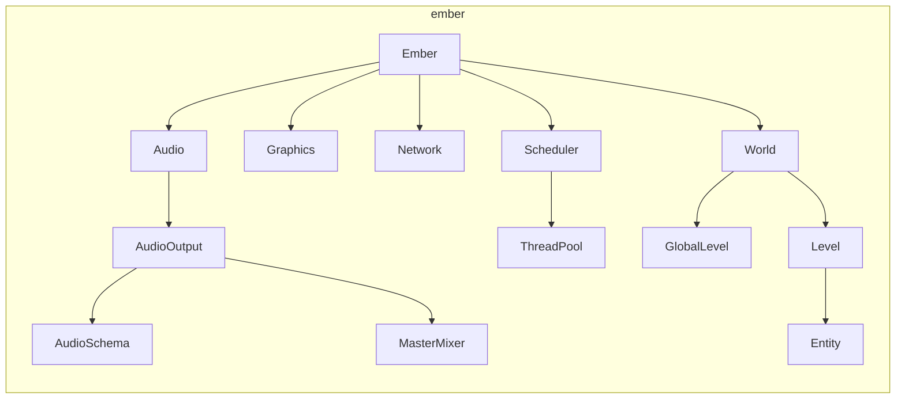
```mermaid
graph LR
    subgraph ember
        Ember[Ember]

        Audio
        AudioOutput
        AudioSchema
        MasterMixer

        Graphics

        Network

        Scheduler
        ThreadPool

        World
        Level
        GlobalLevel
        Entity
    end

    Ember --> Audio
    Ember --> Graphics
    Ember --> Network
    Ember --> Scheduler
    Ember --> World

    Audio --> AudioOutput

    AudioOutput --> AudioSchema
    AudioOutput --> MasterMixer

    Scheduler --> ThreadPool

    World --> GlobalLevel
    World --> Level

    Level --> Entity
```

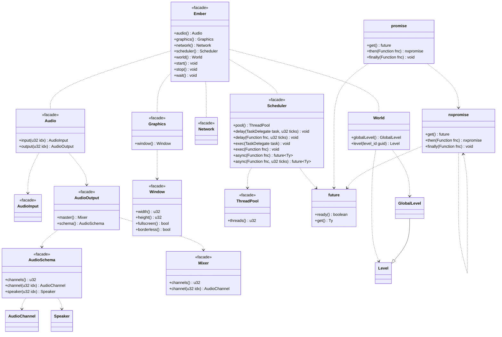
```mermaid
classDiagram
    Ember .. Audio
    Ember .. Graphics
    Ember .. Network
    Ember .. Scheduler
    Ember .. World
    class Ember {
        <<facade>>
        +audio() Audio
        +graphics() Graphics
        +network() Network
        +scheduler() Scheduler
        +world() World

        +start() void
        +stop() void
        +wait() void
    }

    Audio ..> AudioInput
    Audio ..> AudioOutput
    class Audio {
        <<facade>>
        +input(u32 idx) AudioInput
        +output(u32 idx) AudioOutput
    }

    class AudioInput {
        <<facade>>
    }

    AudioOutput ..> AudioSchema
    AudioOutput ..> Mixer
    class AudioOutput {
        <<facade>>
        +master() Mixer
        +schema() AudioSchema
    }

    class Mixer {
        <<facade>>
        +channels() u32
        +channel(u32 idx) AudioChannel
    }

    AudioSchema ..> AudioChannel
    AudioSchema ..> Speaker
    class AudioSchema {
        <<facade>>
        +channels() u32
        +channel(u32 idx) AudioChannel
        +speaker(u32 idx) Speaker
    }

    Graphics ..> Window
    class Graphics {
        <<facade>>
        +window() Window
    }

    class Window {
        <<facade>>
        +width() u32
        +height() u32
        +fullscreen() bool
        +borderless() bool
    }

    class Network {
        <<facade>>
    }

    Scheduler ..> ThreadPool
    Scheduler ..> future
    class Scheduler {
        <<facade>>
        +pool() ThreadPool

        +delay(TaskDelegate task, u32 ticks) void
        +delay(Function fnc, u32 ticks) void

        +exec(TaskDelegate task) void
        +exec(Function fnc) void

        +async(Function fnc) future~Ty~
        +async(Function fnc, u32 ticks) future~Ty~
    }

    class ThreadPool {
        <<facade>>
        +threads() u32
    }

    promise ..> future
    promise ..> nxpromise
    class promise {
        +get() future
        +then(Function fnc) nxpromise
        +finally(Function fnc) void
    }

    nxpromise ..> nxpromise
    nxpromise ..> future
    class nxpromise {
        +get() future
        +then(Function fnc) nxpromise
        +finally(Function fnc) void
    }

    class future {
        +ready() boolean
        +get() Ty
    }

    World ..> GlobalLevel
    World ..> Level
    class World {
        +globalLevel() GlobalLevel
        +level(level_id guid) Level
    }

    class Level {
    }

    GlobalLevel --|> Level
    class GlobalLevel {
    }
```

#### common::types
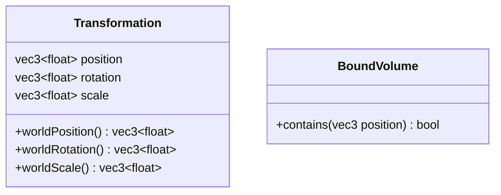
```mermaid
classDiagram
    class Transformation {
        vec3~float~ position
        vec3~float~ rotation
        vec3~float~ scale

        +worldPosition() vec3~float~
        +worldRotation() vec3~float~
        +worldScale() vec3~float~
    }

    class BoundVolume {
        +contains(vec3 position) bool
    }
```

#### ecs::types
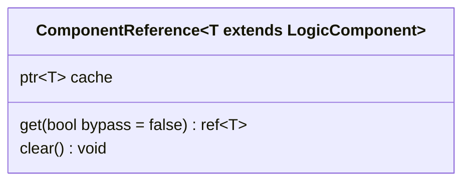
```mermaid
classDiagram
    class ComponentReference~T extends LogicComponent~ {
        ptr~T~ cache

        get(bool bypass = false) ref~T~
        clear() void
    }
```

#### scheduler::types
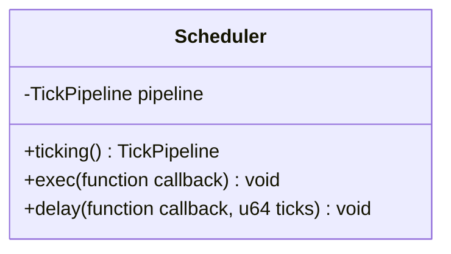
```mermaid
classDiagram
    class Scheduler {
        -TickPipeline pipeline

        +ticking() TickPipeline
        +exec(function callback) void
        +delay(function callback, u64 ticks) void
    }
```

#### ecs::components
> IsComponent\<?> := Class\<?> inherit from `LogicComponent`, `EntityComponent` or `SceneComponent`
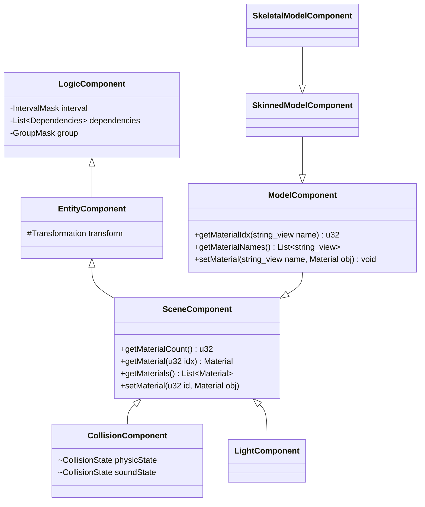
```mermaid
classDiagram
    class LogicComponent {
        -IntervalMask interval
        -List~Dependencies~ dependencies
        -GroupMask group
    }

    LogicComponent <|-- EntityComponent
    class EntityComponent {
        #Transformation transform
    }

    EntityComponent <|-- SceneComponent
    class SceneComponent {
        +getMaterialCount() u32
        +getMaterial(u32 idx) Material
        +getMaterials() List~Material~
        +setMaterial(u32 id, Material obj)
    }

    SceneComponent <|-- CollisionComponent
    class CollisionComponent {
        ~CollisionState physicState
        ~CollisionState soundState
    }

    SceneComponent <|-- LightComponent
    class LightComponent {
    }

    ModelComponent --|> SceneComponent
    class ModelComponent {
        +getMaterialIdx(string_view name) u32
        +getMaterialNames() List~string_view~
        +setMaterial(string_view name, Material obj) void
    }

    SkinnedModelComponent --|> ModelComponent
    class SkinnedModelComponent {
    }

    SkeletalModelComponent --|> SkinnedModelComponent
    class SkeletalModelComponent {
    }
```

#### scene::types
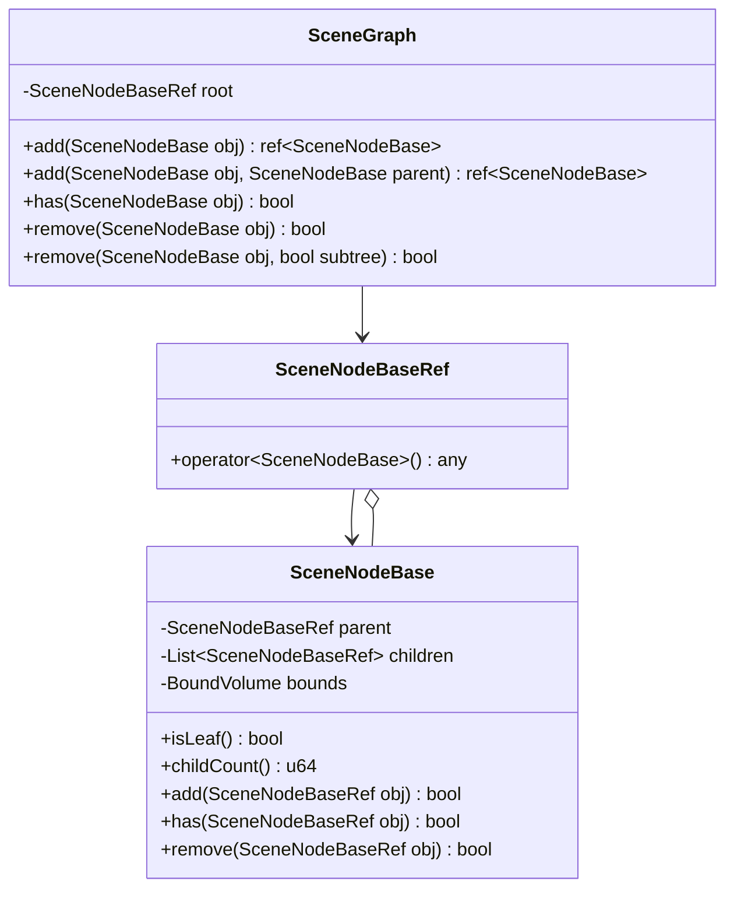
```mermaid
classDiagram
    SceneNodeBaseRef --> SceneNodeBase
    class SceneNodeBaseRef {
        +operator~SceneNodeBase~() any
    }

    SceneNodeBase --o SceneNodeBaseRef
    class SceneNodeBase {
        -SceneNodeBaseRef parent
        -List~SceneNodeBaseRef~ children
        -BoundVolume bounds

        +isLeaf() bool
        +childCount() u64

        +add(SceneNodeBaseRef obj) bool
        +has(SceneNodeBaseRef obj) bool
        +remove(SceneNodeBaseRef obj) bool
    }

    SceneGraph --> SceneNodeBaseRef
    class SceneGraph {
        -SceneNodeBaseRef root

        +add(SceneNodeBase obj) ref~SceneNodeBase~
        +add(SceneNodeBase obj, SceneNodeBase parent) ref~SceneNodeBase~
        +has(SceneNodeBase obj) bool
        +remove(SceneNodeBase obj) bool
        +remove(SceneNodeBase obj, bool subtree) bool
    }
```

## World / Level / Scene

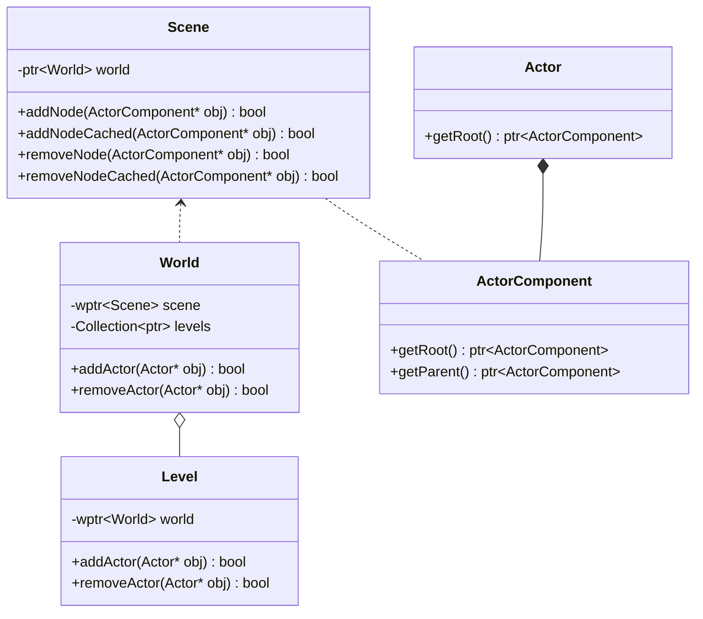
```mermaid
classDiagram
    class Scene
    Scene : -ptr~World~ world
    Scene : +addNode(ActorComponent* obj) bool
    Scene : +addNodeCached(ActorComponent* obj) bool
    Scene : +removeNode(ActorComponent* obj) bool
    Scene : +removeNodeCached(ActorComponent* obj) bool

    Scene <.. World
    class World
    World : -wptr~Scene~ scene
    World : -Collection~ptr<Level>~ levels
    World : +addActor(Actor* obj) bool
    World : +removeActor(Actor* obj) bool

    World o-- Level
    class Level
    Level : -wptr~World~ world
    Level : +addActor(Actor* obj) bool
    Level : +removeActor(Actor* obj) bool

    class Actor
    Actor : +getRoot() ptr~ActorComponent~

    Actor *-- ActorComponent
    Scene .. ActorComponent
    class ActorComponent
    ActorComponent : +getRoot() ptr~ActorComponent~
    ActorComponent : +getParent() ptr~ActorComponent~
```

#### game::world
> `World` contains 1..N levels\
> `World` contains 1 level : GlobalLevel\
> `World` is represented by [ `Engine` : `Scene` ]

> `Level` contains 0..N entities

> `Entity` has 0..N `Class<?> extends LogicComponent`

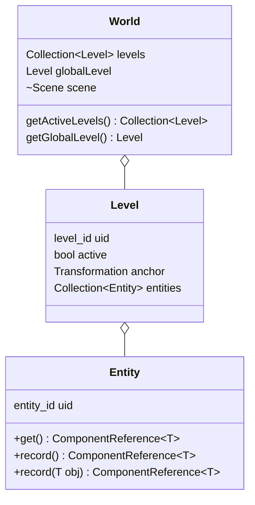
```mermaid
classDiagram
    class World {
        Collection~Level~ levels
        Level globalLevel

        getActiveLevels() Collection~Level~
        getGlobalLevel() Level

        ~Scene scene
    }

    World o-- Level
    class Level {
        level_id uid
        bool active
        Transformation anchor
        Collection~Entity~ entities
    }

    Level o-- Entity
    class Entity {
        entity_id uid

        +get() ComponentReference~T~
        +record() ComponentReference~T~
        +record(T obj) ComponentReference~T~
    }
```

#### engine::proxy
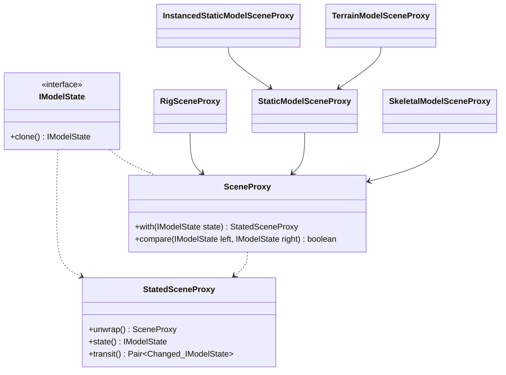
```mermaid
classDiagram
    class StatedSceneProxy {
        +unwrap() SceneProxy
        +state() IModelState

        +transit() Pair~Changed_IModelState~
    }

    IModelState .. SceneProxy
    IModelState ..> StatedSceneProxy
    class IModelState {
        <<interface>>
        +clone() IModelState
    }

    SceneProxy ..> StatedSceneProxy
    class SceneProxy {
        +with(IModelState state) StatedSceneProxy
        +compare(IModelState left, IModelState right) boolean
    }

    RigSceneProxy --> SceneProxy
    class RigSceneProxy {
    }

    StaticModelSceneProxy --> SceneProxy
    class StaticModelSceneProxy {
    }

    InstancedStaticModelSceneProxy --> StaticModelSceneProxy
    class InstancedStaticModelSceneProxy {
    }

    TerrainModelSceneProxy --> StaticModelSceneProxy
    class TerrainModelSceneProxy {
    }

    SkeletalModelSceneProxy --> SceneProxy
    class SkeletalModelSceneProxy {
    }

```

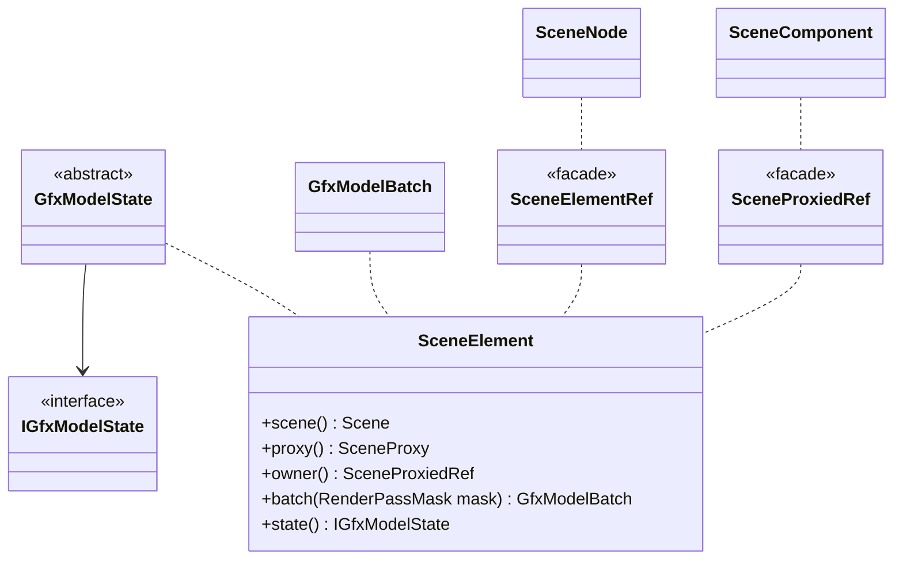
```mermaid
classDiagram
    class SceneElement {
        +scene() Scene
        +proxy() SceneProxy

        +owner() SceneProxiedRef

        +batch(RenderPassMask mask) GfxModelBatch
        +state() IGfxModelState
    }

    class IGfxModelState {
        <<interface>>
    }

    GfxModelState .. SceneElement
    GfxModelState --> IGfxModelState
    class GfxModelState {
        <<abstract>>
    }

    GfxModelBatch .. SceneElement
    class GfxModelBatch {
    }

    SceneProxiedRef .. SceneElement
    class SceneProxiedRef {
        <<facade>>
    }

    SceneComponent .. SceneProxiedRef
    class SceneComponent {
    }

    SceneElementRef .. SceneElement
    class SceneElementRef {
        <<facade>>
    }

    SceneNode .. SceneElementRef
    class SceneNode {
    }
```

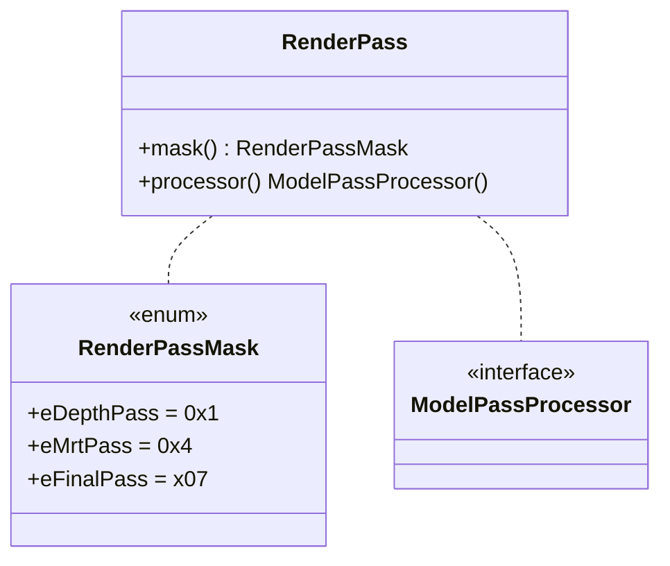
```mermaid
classDiagram
    class RenderPassMask {
        <<enum>>
        +eDepthPass = 0x1
        +eMrtPass = 0x4
        +eFinalPass = x07
    }

    class ModelPassProcessor {
        <<interface>>
    }

    RenderPass .. RenderPassMask
    RenderPass .. ModelPassProcessor
    class RenderPass {
        +mask() RenderPassMask
        +processor() ModelPassProcessor()
    }
```

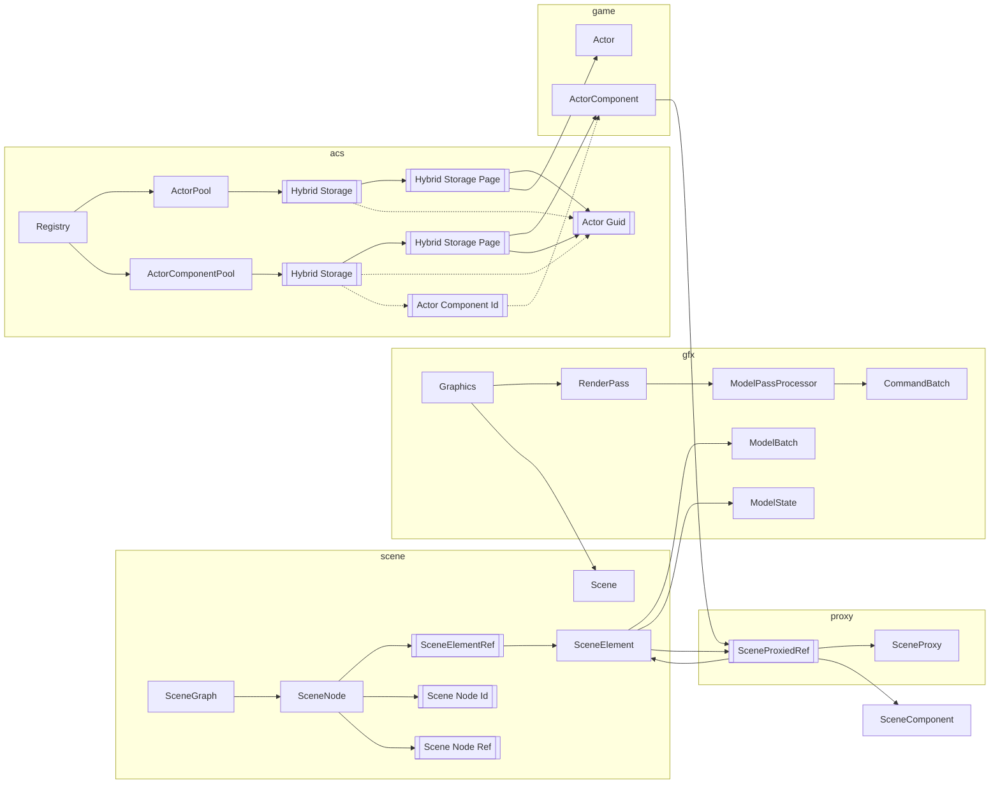
```mermaid
graph LR
    subgraph gfx
        Graphics

        RenderPass
        ModelPassProcessor
        ModelBatch
        ModelState

        CommandBatch
    end

    subgraph scene
        Scene

        SceneGraph
        SceneNode
        SceneNodeId[[Scene Node Id]]
        SceneNodeRef[[Scene Node Ref]]

        SceneElement
        SceneElementRef[[SceneElementRef]]
    end

    subgraph proxy
        SceneProxy
        SceneProxiedRef[[SceneProxiedRef]]
    end

    subgraph acs
        Registry

        ActorPool

        ActorComponentPool

        AHybridStorage[[Hybrid Storage]]
        ACHybridStorage[[Hybrid Storage]]

        AHybridStoragePage[[Hybrid Storage Page]]
        ACHybridStoragePage[[Hybrid Storage Page]]

        ActorGuid[[Actor Guid]]
        ActorComponentId[[Actor Component Id]]
    end

    subgraph game
        Actor
        ActorComponent
    end

    Graphics --> RenderPass
    Graphics --> Scene

    RenderPass --> ModelPassProcessor

    ModelPassProcessor --> CommandBatch

    SceneGraph --> SceneNode

    SceneNode --> SceneElementRef
    SceneNode --> SceneNodeId
    SceneNode --> SceneNodeRef

    SceneElementRef --> SceneElement

    SceneElement --> ModelBatch
    SceneElement --> ModelState
    SceneElement --> SceneProxiedRef

    Registry --> ActorPool
    Registry --> ActorComponentPool

    ActorPool --> AHybridStorage

    AHybridStorage --> AHybridStoragePage
    AHybridStorage -.-> ActorGuid

    AHybridStoragePage --> ActorGuid
    AHybridStoragePage --> Actor

    ActorComponentPool --> ACHybridStorage

    ACHybridStorage --> ACHybridStoragePage
    ACHybridStorage -.-> ActorGuid
    ACHybridStorage -.-> ActorComponentId;

    ACHybridStoragePage --> ActorComponent
    ACHybridStoragePage --> ActorGuid

    ActorComponentId -.-> ActorComponent

    ActorComponent --> SceneProxiedRef

    SceneProxiedRef --> SceneProxy
    SceneProxiedRef --> SceneElement
    SceneProxiedRef --> SceneComponent
```

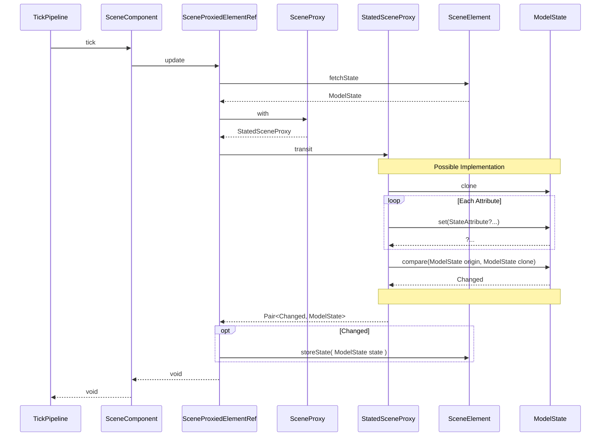
```mermaid
sequenceDiagram
    participant TickPipeline
    participant SceneComponent
    participant SceneProxiedElementRef
    participant SceneProxy
    participant StatedSceneProxy
    participant SceneElement
    participant ModelState

    TickPipeline->>SceneComponent: tick
        SceneComponent->>SceneProxiedElementRef: update
            SceneProxiedElementRef->>SceneElement: fetchState
            SceneElement-->>SceneProxiedElementRef: ModelState
            
            SceneProxiedElementRef->>SceneProxy: with
            SceneProxy-->>SceneProxiedElementRef: StatedSceneProxy

            SceneProxiedElementRef->>StatedSceneProxy: transit
                Note over StatedSceneProxy,ModelState: Possible Implementation
                StatedSceneProxy->>ModelState: clone
                loop Each Attribute
                    StatedSceneProxy->>ModelState: set(StateAttribute?...)
                    ModelState-->>StatedSceneProxy: ?...
                end
                StatedSceneProxy->>ModelState: compare(ModelState origin, ModelState clone)
                ModelState-->>StatedSceneProxy: Changed
                Note over ModelState,StatedSceneProxy: 
            StatedSceneProxy-->>SceneProxiedElementRef: Pair<Changed, ModelState>

            opt Changed
                SceneProxiedElementRef->>SceneElement: storeState( ModelState state )
            end
        SceneProxiedElementRef-->>SceneComponent: void
    SceneComponent-->>TickPipeline: void
```

#### utils::execution
```mermaid
classDiagram
    PipelineStage o-- Dispatchable
    class Dispatchable~?~ {
    }

    Pipeline o-- PipelineStage
    class PipelineStage {
        List~Dispatchable~
    }

    class Pipeline {
        List~PipelineStage~ stages

        execute(seq) void
        execute(unseq) void
    }

    TickPipeline --|> Pipeline
    class TickPipeline {
    }
```

#### ecs::storage
```mermaid
classDiagram
    HybridStorage~T extends LogicComponent~ --o HybridStoragePage~T extends LogicComponent~
    class HybridStoragePage~T extends LogicComponent~ {
        -List~entity_id~ arrangedUids
        -List~T~ arrangedStorage

        +get(index_type idx) T | null
        +store(T obj) index_type
        +remove(index_type idx) bool

        +size() u64
        +capacity() u64
    }
    
    class HybridStorage~T extends LogicComponent~ {
        Map~entity_id, compound_index~ mapping
        List~HybridStoragePage~ pages

        +has(entity_id uid) bool
        +get(entity_id uid) T
        +insert(entity_id uid, T obj) T
        +remove(entity_id uid) bool

        +size() u64
        +capacity() u64
    }
```

#### material

```mermaid
classDiagram
    class Color {
        +r float
        +g float
        +b float
        +a float

        +hsla() Color
        +hsl() Color
        +rgba() Color
        +rgb() Color
    }

    class TextureBuffer {
        <<facade>>
        #ref<InternlTextureBuffer> internal

        +valid() bool
        +operator bool() bool
    }

    class Texture {
        <<facade>>
        #ref<InternalTexture> _internal

        +width() u32
        +height() u32
        +depth() u32
        +layer() u32

        +is_cube() bool
        +is_po2() bool
        +is_virtual() bool
        +is_subresource() bool

        +as~CubeTexture~() CubeTexture
        +as~VirtualTexture~() VirtualTexture

        +buffer() TextureBuffer

        +internal() managed~void~
    }

    CubeTexture --|> Texture
    class CubeTexture {
        <<facade>>

        +as~Texture~() Texture
    }

    VirtualTexture --|> Texture
    class VirtualTexture {
        <<facade>>

        +as~Texture~() Texture
    }

    class GfxMaterial {
        <<facade>>
        #ref<InternalMaterial> internal

        +albedoColor() Color
        +albedoTexture() Texture

        +metalness() float
        +metalnessTexture() Texture

        +roughness() float
        +roughnessTexture() Texture

        +aoTexture() Texture
        +normalTexture() Texture
        +displacementTexture() Texture

        +internal() managed~void~
    }

    class PfxMaterial {
        <<facade>>
        #ref<InternalMaterial> internal
    }
```

#### __Entity Properties__
> `Entity` contains 0..N components of `Class<?> extends LogicComponent`\
> `Entity` contains 1 root component if `Ǝi∈[Class<?>] (i instanceOf EntityComponent)`\
> `Entity` contains 0..N components of `Class<?> extends EntityComponent` below root\
> `Entity` has no transformation -> inherit from `EntityComponent` or `Class<?> extends EntityComponent`
```mermaid
classDiagram
    Class~? extends LogicComponent~ --* Entity
```

#### Update, Traversal
```mermaid
sequenceDiagram
    participant Scheduler
    participant TickPipeline
    participant TickPipelineStage
    participant Dispatchable
    participant HybridStorage
    participant HybridStoragePage
    participant Component

    rect rgba(0, 0, 255, .2)
        Scheduler->>TickPipeline: execute
        loop Every Stage
            TickPipeline->>TickPipelineStage: execute
            par
                TickPipelineStage->>Dispatchable: before
                Dispatchable-->>TickPipelineStage: return
            end
            par
                TickPipelineStage->>Dispatchable: invoke
                    rect rgba(0, 255, 0, .2)
                        Dispatchable->>HybridStorage: update
                            HybridStorage->>HybridStorage: fetchCurrentPage
                            HybridStorage->>HybridStoragePage: update
                                rect rgb(144, 32, 37)
                                    loop Every Component
                                        HybridStoragePage->>Component: tick
                                        Component-->>HybridStoragePage: return
                                    end
                                end
                            HybridStoragePage-->HybridStorage: return
                        HybridStorage-->>Dispatchable: return
                    end
                Dispatchable-->>TickPipelineStage: return
            end
            par
                TickPipelineStage->>Dispatchable: after
                Dispatchable-->>TickPipelineStage: return
            end
            TickPipelineStage-->>TickPipeline: return
        end
        TickPipeline-->>Scheduler: return
    end
```

```mermaid
sequenceDiagram
    participant ?Scheduler
    participant Graphics
    participant RenderPass
    participant Scene
    participant SceneNodeQueue
    participant SceneNode

    rect rgba(0, 0, 255, .2)
        par
            ?Scheduler->>Graphics: before
            Graphics-->>?Scheduler: return
        end

        par
                ?Scheduler->>Graphics: invoke
                rect rgba(0, 255, 0, .2)
                    loop Every RenderPass
                        Graphics->>Graphics: fetchRenderPass
                        Graphics->>Scene: traversal
                            Scene->>SceneNodeQueue: construct
                            Scene->>Scene: fetchRoot
                            Scene->>SceneNodeQueue: pushNotes
                            Scene->>SceneNodeQueue: traversal

                            rect rgb(144, 32, 37)
                                loop Every SceneNode in SceneNodeQueue
                                    alt Satifies Condition
                                        SceneNode->>SceneNode: drawConditional
                                        opt Is not Leaf
                                            SceneNode->>SceneNode: fetchChildren
                                            SceneNode->>SceneNodeQueue: pushNodes
                                        end
                                    else
                                        SceneNode->>SceneNode: discard
                                    end
                                end
                            end

                            SceneNodeQueue-->>Scene: return
                        Scene-->>Graphics: return
                    end
                end
                Graphics-->>?Scheduler: return
            end

        par
            ?Scheduler->>Graphics: after
            Graphics-->>?Scheduler: return
        end
    end
```

```mermaid
stateDiagram-v2
    DP_FrustumCulling : Frustum Culling
    DP_ModelBatch : Model Batch
    LP_FrustumCulling : Frustum Culling
    LP_ModelBatch : Model Batch
    LP_OcclusionCulling : Occlusion Culling
    PP_FrustumCulling : Frustum Culling
    PP_ModelBatch : Model Batch
    PP_OcclusionCulling : Occlusion Culling
    CP_FrustumCulling : Frustum Culling
    CP_ModelBatch : Model Batch
    CP_OcclusionCulling : Occlusion Culling

    [*] --> RenderTick
    RenderTick --> [*]

    state RenderTick {
        [*] --> NextFrame
        NextFrame --> PassProcessing
        PassProcessing --> [*]

        state PassProcessing {
            [*] --> DepthPass
            DepthPass --> DepthQuery
            DepthQuery --> LightPass
            LightPass --> ProbePass
            ProbePass --> PbrPass
            PbrPass --> FinalPass
            FinalPass --> [*]

            state DepthPass {
                [*] --> DP_FrustumCulling
                DP_FrustumCulling --> DP_ModelBatch
                DP_ModelBatch --> RenderOccluder
                RenderOccluder --> [*]
            }

            state LightPass {
                [*] --> LP_FrustumCulling
                LP_FrustumCulling --> LP_OcclusionCulling
                LP_OcclusionCulling --> LP_ModelBatch
                LP_ModelBatch --> RenderLight
                RenderLight --> [*]
            }

            state ProbePass {
                [*] --> PP_FrustumCulling
                PP_FrustumCulling --> PP_OcclusionCulling
                PP_OcclusionCulling --> PP_ModelBatch
                PP_ModelBatch --> RenderProbes
                RenderProbes --> [*]
            }

            state PbrPass {
                [*] --> CP_FrustumCulling
                CP_FrustumCulling --> CP_OcclusionCulling
                CP_OcclusionCulling --> CP_ModelBatch
                CP_ModelBatch --> RenderPBRDeferred
                RenderPBRDeferred --> [*]
            }

            state FinalPass {
                [*] --> RenderPbrMrt
                RenderPbrMrt --> SignalFrame
                SignalFrame --> [*]
            }
        }

        --
        
        [*] --> NextImage
        NextImage --> Passive_PassProcessing
        Passive_PassProcessing --> Execution
        Execution --> Presentation
        Presentation --> [*]

        state NextImage {
            [*] --> WaitFence
            WaitFence --> AcquireImage
            AcquireImage --> [*]
        }

        state Passive_PassProcessing {
            [*] --> WaitFinalPass
            WaitFinalPass --> [*]
        }

        state Execution {
            [*] --> Compose
            Compose --> Submit
            Submit --> Barrier
            Barrier --> [*]
        }

        state Presentation {
            [*] --> WaitBarrier
            WaitBarrier --> Display
            Display --> [*]
        }
    }
```

```mermaid
graph LR
    RenderPass --> DepthPass( DepthPass - Occlusion Culling )
    RenderPass --> LightPass( LightPass - Effecting Lights)
    RenderPass --> ProbePass( ProbePass - Light Probes, PBR Reflections)
    RenderPass --> PbrPass( PbrPass - G-Buffer )
    RenderPass --> FinalPass( FinalPass - Consume G-Buffer, PBR Shading )
```

```mermaid
graph LR
    G-Buffer --> Image0( Image0 - Albedo.r, Albedo.g, Albedo.b, AO.v )
    G-Buffer --> Image1( Image1 - Normal.x, Normal.y, Normal.z )
    G-Buffer --> Image2( Image2 - Metalness.v, Roughness.v, Specular.v )
    G-Buffer --> Image3( Image3 - Depth.v, Stencil.v )
```

## Scheduling

### Scheduling Pipeline

```mermaid
gantt
    title Pipeline Stages | First Start Execution <-> Last Start Execution
    dateFormat DD-MM-YYYY
    axisFormat %d

    Begin Cycle : milestone, fc, 01-01-1970, 0d
    Running Cycle : 7d
    Next Cycle : milestone, ce, 08-01-1970, 0d
    Running Cycle : 7d
    End Cycle milestone : milestone, sc, 15-01-1970, 0d

    section [Non-Guarantee]
    All <-> Undefined :crit, ngau, 01-01-1970, 15-01-1970

    section Top
    Strong <-> Strong :active, tss, 01-01-1970, 02-01-1970
    Strong <-> Weak :tsw, 01-01-1970, 1d
    Weak <-> Strong :done, tws, 08-01-1970, 1d
    Weak <-> Weak :tww, 08-01-1970, 1d

    section NetworkFetch
    Strong <-> Strong :active, nfss, after tss, 1d
    Strong <-> Weak :nfsw, after tss, 1d
    Weak <-> Strong :done, nfws, after tws, 1d
    Weak <-> Weak :nfww, after tws, 1d

    section UserUpdate
    Strong <-> Strong :active, uuss, after nfss, 1d
    Strong <-> Weak :uusw, after nfss, 1d
    Weak <-> Strong :done, uuws, after nfws, 1d
    Weak <-> Weak :uuww, after nfws, 1d

    section Publish
    Strong <-> Strong :active, pss, after uuss, 1d
    Strong <-> Weak :psw, after uuss, 1d
    Weak <-> Strong :done, pws, after uuws, 1d
    Weak <-> Weak :pww, after uuws, 1d

    section PhysicsSimulate
    Strong <-> Strong :active, psss, after pss, 1d
    Strong <-> Weak :pssw, after pss, 1d
    Weak <-> Strong :done, psws, after pws, 1d
    Weak <-> Weak :psww, after pws, 1d

    section GraphicNodeCollect
    Strong <-> Strong :active, gncss, after psss, 1d
    Strong <-> Weak :gncsw, after psss, 1d
    Weak <-> Strong :done, gncws, after psws, 1d
    Weak <-> Weak :gncww, after psws, 1d

    section Bottom
    Strong <-> Strong :active, bss, after gncss, 1d
    Strong <-> Weak :bsw, after gncss, 1d
    Weak <-> Strong :done, bws, after gncws, 1d
    Weak <-> Weak :bww, after gncws, 1d

    section [Composit]
    Top Strong <-> Publish Strong :active, 01-01-1970, 4d
    Top Strong <-> Publish Weak :done, 01-01-1970, 4d
    Top Weak <-> Publish Strong :active, 08-01-1970, 4d
    Top Weak <-> Publish Weak :done, 08-01-1970, 4d
```

```mermaid
gantt
    title Pipeline Stages | First Start Execution <-> Finished Execution
    dateFormat DD-MM-YYYY
    axisFormat %d

    Begin Cycle : milestone, fc, 01-01-1970, 0d
    Running Cycle : 7d
    Next Cycle : milestone, ce, 08-01-1970, 0d
    Running Cycle : 7d
    End Cycle milestone : milestone, sc, 15-01-1970, 0d

    section [Non-Guarantee]
    All <-> Undefined :crit, ngau, 01-01-1970, 15-01-1970

    section Top
    Strong <-> Strong :active, tss, 01-01-1970, 02-01-1970
    Strong <-> Weak :tsw, 01-01-1970, 14d
    Weak <-> Strong :done, tws, 08-01-1970, 1d
    Weak <-> Weak :tww, 08-01-1970, 7d

    section NetworkFetch
    Strong <-> Strong :active, nfss, after tss, 1d
    Strong <-> Weak :nfsw, after tss, 13d
    Weak <-> Strong :done, nfws, after tws, 1d
    Weak <-> Weak :nfww, after tws, 6d

    section UserUpdate
    Strong <-> Strong :active, uuss, after nfss, 1d
    Strong <-> Weak :uusw, after nfss, 12d
    Weak <-> Strong :done, uuws, after nfws, 1d
    Weak <-> Weak :uuww, after nfws, 5d

    section Publish
    Strong <-> Strong :active, pss, after uuss, 1d
    Strong <-> Weak :psw, after uuss, 11d
    Weak <-> Strong :done, pws, after uuws, 1d
    Weak <-> Weak :pww, after uuws, 4d

    section PhysicsSimulate
    Strong <-> Strong :active, psss, after pss, 1d
    Strong <-> Weak :pssw, after pss, 10d
    Weak <-> Strong :done, psws, after pws, 1d
    Weak <-> Weak :psww, after pws, 3d

    section GraphicNodeCollect
    Strong <-> Strong :active, gncss, after psss, 1d
    Strong <-> Weak :gncsw, after psss, 9d
    Weak <-> Strong :done, gncws, after psws, 1d
    Weak <-> Weak :gncww, after psws, 2d

    section Bottom
    Strong <-> Strong :active, bss, after gncss, 1d
    Strong <-> Weak :bsw, after gncss, 8d
    Weak <-> Strong :done, bws, after gncws, 1d
    Weak <-> Weak :bww, after gncws, 1d

    section [Composit]
    Top Strong <-> Publish Strong :active, 01-01-1970, 4d
    Top Strong <-> Publish Weak :done, 01-01-1970, 14d
    Top Weak <-> Publish Strong :active, 08-01-1970, 4d
    Top Weak <-> Publish Weak :done, 08-01-1970, 7d
```

## Graphics

### Graphic Resources

```mermaid
classDiagram
    Graphics ..> Scene
    Graphics .. GraphicPass
    Graphics ..> ResourceMapping
    class Graphics {
        <<module>>
    }

    GraphicPass .. ModelPassProcessor
    GraphicPass ..> SceneGraph
    class GraphicPass {
    }

    ModelPassProcessor ..> SceneNodeModel
    ModelPassProcessor ..> ProcessedModelState
    class ModelPassProcessor {
    }

    IRenderScene ..> SceneGraph
    class IRenderScene {
        <<interface>>
    }

    class Scene {
        <<abstract>>
    }

    RevScene --> Scene
    RevScene --> IRenderScene
    class RevScene {
    }

    Actor ..> SceneComponent
    class Actor {
    }

    SceneComponent ..> Scene
    class SceneComponent {
        <<abstract>>
    }

    class SceneGraph {
    }

    SceneNodeModel ..> SceneGraph
    class SceneNodeModel {
        <<abstract>>
    }

    ModelComponent --> SceneComponent
    class ModelComponent {
    }

    StaticMeshComponent --> ModelComponent
    StaticMeshComponent ..> StaticMeshAsset
    StaticMeshComponent ..> StaticMeshModel
    class StaticMeshComponent {
    }

    Asset ..> ResourceManager
    Asset ..> ResourceMapping
    class Asset {
        <<abstract>>
    }

    ResourceManager ..> Resource
    class ResourceManager {
    }

    class Resource {
    }

    StaticMeshModel --> SceneNodeModel
    StaticMeshModel ..> Asset
    class StaticMeshModel {
    }

    StaticMeshAsset ..> Asset
    class StaticMeshAsset {
        <<facade>>
    }

    ResourceMapping ..> ResourceManager
    ResourceMapping ..> ResourceMaterialMapping
    ResourceMapping ..> ResourceMeshMapping
    ResourceMapping ..> ResourceTextureMapping
    class ResourceMapping {
    }

    ResourceMaterialMapping ..> MappedMaterial
    ResourceMaterialMapping ..> Resource
    class ResourceMaterialMapping {
    }

    ResourceMeshMapping ..> MappedMesh
    ResourceMaterialMapping ..> Resource
    class ResourceMeshMapping {
    }

    ResourceTextureMapping ..> MappedTexture
    ResourceMaterialMapping ..> Resource
    class ResourceTextureMapping {
    }

    class MappedMesh {
    }

    class MappedMaterial {
    }

    ProcessedModelState ..> MappedMesh
    ProcessedModelState ..> MappedMaterial
    ProcessedModelState ..> MappedTexture
    class ProcessedModelState {
    }
```